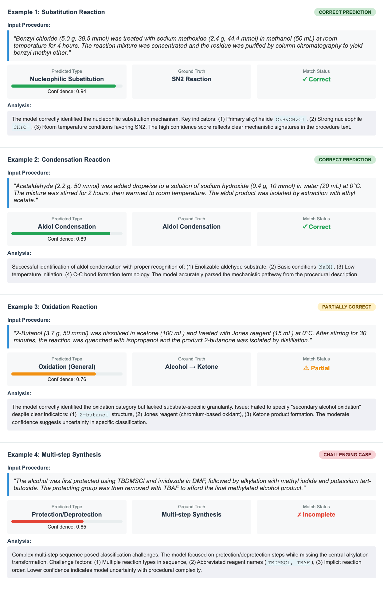

# Analysis & Evaluation Guide

Comprehensive guide to RxNExtract's analysis and evaluation framework for research-grade assessment and reproducibility.

## 🔍 Overview

RxNExtract includes a comprehensive analysis suite designed for systematic evaluation of chemical reaction extraction performance. This framework enables researchers to:

- **Analyze extraction errors** across different categories and complexity levels
- **Conduct ablation studies** to understand component contributions
- **Perform statistical analysis** with significance testing
- **Quantify uncertainty** and calibrate confidence scores
- **Calculate comprehensive metrics** for research reproducibility

## 📊 Error Analysis Framework

### Basic Error Analysis

```python
from chemistry_llm.analysis import ErrorAnalyzer

# Initialize error analyzer
error_analyzer = ErrorAnalyzer()

# Load your predictions and ground truth
predictions = load_predictions("model_predictions.json")
ground_truth = load_ground_truth("ground_truth.json")

# Comprehensive error analysis
error_results = error_analyzer.analyze_prediction_errors(
    predictions=predictions,
    ground_truth=ground_truth,
    method_name="RxNExtract-Complete"
)

# Generate detailed error report
report = error_analyzer.generate_error_report(
    error_results, 
    output_file="error_analysis_report.txt"
)

print(f"Total errors analyzed: {error_results.total_errors}")
print(f"Entity recognition errors: {error_results.entity_errors}")
print(f"Role classification errors: {error_results.role_errors}")
print(f"Condition extraction errors: {error_results.condition_errors}")
```



### Error Categories

#### 1. Entity Recognition Errors
- **Missing Entities**: Compounds mentioned in text but not extracted
- **False Positives**: Non-chemical entities incorrectly identified as compounds
- **Incorrect Entity Types**: Chemical compounds misclassified (e.g., salt as organic compound)

```python
# Analyze entity recognition errors specifically
entity_analysis = error_analyzer.analyze_entity_errors(
    predictions=predictions,
    ground_truth=ground_truth,
    include_details=True
)

print("Entity Recognition Error Breakdown:")
print(f"Missing entities: {entity_analysis.missing_entities_rate:.1f}%")
print(f"False positives: {entity_analysis.false_positive_rate:.1f}%")
print(f"Type misclassification: {entity_analysis.type_error_rate:.1f}%")
```

#### 2. Role Classification Errors
- **Reactant/Product Confusion**: Misassigning chemical roles
- **Catalyst Misidentification**: Catalysts incorrectly classified as reactants
- **Solvent Misclassification**: Solvents confused with reactants or reagents

```python
# Role classification error analysis
role_analysis = error_analyzer.analyze_role_classification_errors(
    predictions=predictions,
    ground_truth=ground_truth
)

print("Role Classification Errors:")
print(f"Reactant/product confusion: {role_analysis.reactant_product_confusion:.1f}%")
print(f"Catalyst misidentification: {role_analysis.catalyst_errors:.1f}%")
print(f"Solvent misclassification: {role_analysis.solvent_errors:.1f}%")
```

#### 3. Condition Extraction Errors
- **Missing Temperature/Time**: Reaction conditions not extracted
- **Incomplete Procedures**: Partial extraction of multi-step processes
- **Unit Conversion Errors**: Incorrect handling of measurement units
- **Implicit Condition Interpretation**: Failure to infer standard conditions

```python
# Condition extraction error analysis
condition_analysis = error_analyzer.analyze_condition_extraction_errors(
    predictions=predictions,
    ground_truth=ground_truth,
    include_implicit=True
)

print("Condition Extraction Errors:")
print(f"Missing temperature: {condition_analysis.missing_temperature:.1f}%")
print(f"Missing time: {condition_analysis.missing_time:.1f}%")
print(f"Incomplete procedures: {condition_analysis.incomplete_procedures:.1f}%")
print(f"Unit errors: {condition_analysis.unit_errors:.1f}%")
```

#### 4. Chain-of-Thought (CoT) Reasoning Failures
- **Implicit Condition Interpretation**: Failure to reason about unstated conditions
- **Generic Entity Handling**: Inability to resolve generic terms like "the compound"
- **Multi-step Confusion**: Errors in tracking entities across procedure steps

```python
# CoT failure analysis (requires raw model outputs)
cot_failures = error_analyzer.analyze_cot_failures(
    predictions=predictions,
    ground_truth=ground_truth,
    raw_outputs=raw_model_outputs,
    reasoning_steps=True
)

print("Chain-of-Thought Failure Analysis:")
print(f"Implicit reasoning failures: {cot_failures.implicit_failures:.1f}%")
print(f"Generic entity failures: {cot_failures.generic_entity_failures:.1f}%")
print(f"Multi-step tracking errors: {cot_failures.multistep_errors:.1f}%")
```

### Method Comparison

```python
# Compare multiple methods
method_results = {
    'baseline': baseline_error_results,
    'cot_only': cot_error_results,
    'complete_framework': complete_error_results
}

# Perform comparative error analysis
error_comparisons = error_analyzer.compare_methods(method_results)

# Generate comparison report
comparison_report = error_analyzer.generate_comparison_report(
    error_comparisons,
    output_file="method_comparison_report.txt"
)

print("Error Reduction Summary:")
for comparison in error_comparisons:
    print(f"{comparison.error_type}: {comparison.error_reduction:.1f}% reduction")
```

## 🧪 Ablation Studies

Systematic component-level performance analysis to understand the contribution of different framework components.

### Complete Ablation Study

```python
from chemistry_llm.analysis import AblationStudy

# Initialize ablation study
ablation = AblationStudy(
    model_path="./model",
    config_path="./config/ablation_config.yaml"
)

# Run complete ablation study
study_results = ablation.run_complete_study(
    test_data=test_procedures,
    ground_truth=ground_truth,
    sample_size=1000,
    stratified=True,  # Stratify by reaction complexity
    complexity_levels=['simple', 'moderate', 'complex'],
    random_state=42
)

# Generate comprehensive ablation report
report = ablation.generate_ablation_report(
    study_results, 
    output_file="ablation_study_report.txt"
)

print("Ablation Study Results:")
for config_name, metrics in study_results.items():
    print(f"{config_name:20}: CRA = {metrics.cra:.3f}, F1 = {metrics.entity_f1:.3f}")
```

### Ablation Configurations

#### 1. Direct Extraction (Baseline)
Basic extraction without any enhancements.

#### 2. Structured Output
XML-formatted output for better parsing.

#### 3. Meta Prompt
Enhanced prompt engineering with task-specific instructions.

#### 4. Chain-of-Thought (CoT)
Step-by-step reasoning approach.

#### 5. CoT + Reflection
Chain-of-thought with self-reflection and correction.

#### 6. Self-Grounding
Entity validation and consistency checking.

#### 7. Complete Framework
All components combined (recommended configuration).

#### 8. Iterative Refinement
Multi-pass extraction with refinement.

### Dynamic Prompt Analysis

```python
# Analyze dynamic prompt component contributions
dynamic_analysis = ablation.analyze_dynamic_prompt_components(
    test_sample=test_procedures[:100],
    truth_sample=ground_truth[:100],
    prompt_variants=[
        'basic_prompt',
        'cot_prompt', 
        'reflective_prompt',
        'self_grounding_prompt'
    ]
)

# Component contribution analysis
contributions = ablation.analyze_component_contributions(study_results)

print("Component Contributions:")
for component, contribution in contributions.items():
    print(f"{component}: +{contribution:.1f}% CRA improvement")

# Interaction effects analysis
interactions = ablation.analyze_interaction_effects(
    study_results,
    components=['cot', 'reflection', 'self_grounding']
)
```

### Complexity-Stratified Analysis

```python
# Analyze performance by reaction complexity
complexity_results = ablation.analyze_by_complexity(
    study_results,
    complexity_labels=complexity_labels,
    stratification_method='balanced'  # 'balanced', 'natural', 'quantile'
)

print("Performance by Complexity:")
for complexity in ['simple', 'moderate', 'complex']:
    results = complexity_results[complexity]
    print(f"{complexity:10}: CRA = {results['cra']:.3f}, "
          f"Entity F1 = {results['entity_f1']:.3f}")

# Export detailed results
ablation.export_results_to_csv(study_results, "ablation_detailed_results.csv")
ablation.export_complexity_analysis(complexity_results, "complexity_analysis.csv")
```

## 📈 Statistical Analysis

Comprehensive statistical testing for research reproducibility and significance assessment.

### Pairwise Method Comparison

```python
from chemistry_llm.analysis import StatisticalAnalyzer

# Initialize statistical analyzer
stats_analyzer = StatisticalAnalyzer(
    significance_level=0.05,
    confidence_level=0.95
)

# Load results from different methods
baseline_cra_scores = [r['cra'] for r in baseline_results]
complete_cra_scores = [r['cra'] for r in complete_framework_results]

# Perform pairwise statistical comparison
comparison = stats_analyzer.perform_pairwise_comparison(
    method1_results=baseline_cra_scores,
    method2_results=complete_cra_scores,
    method1_name="Baseline",
    method2_name="Complete Framework",
    test_type="paired_t",  # 'paired_t', 'wilcoxon', 'mann_whitney'
    effect_size=True
)

print("Statistical Comparison Results:")
print(f"Test statistic: {comparison['statistic']:.4f}")
print(f"p-value: {comparison['p_value']:.6f}")
print(f"Effect size (Cohen's d): {comparison['effect_size']:.3f}")
print(f"95% Confidence Interval: [{comparison['ci_lower']:.3f}, {comparison['ci_upper']:.3f}]")
print(f"Statistically significant: {comparison['significant']}")
```

### McNemar's Test for Classification Performance

```python
# McNemar's test for paired classification results
baseline_correct = [is_completely_correct(pred, truth) 
                   for pred, truth in zip(baseline_results, ground_truth)]
complete_correct = [is_completely_correct(pred, truth) 
                   for pred, truth in zip(complete_results, ground_truth)]

mcnemar_result = stats_analyzer.perform_mcnemar_test(
    method1_correct=baseline_correct,
    method2_correct=complete_correct,
    method1_name="Baseline",
    method2_name="Complete Framework"
)

print("McNemar's Test Results:")
print(f"McNemar's χ²: {mcnemar_result['statistic']:.2f}")
print(f"p-value: {mcnemar_result['p_value']:.6f}")
print(f"Significant improvement: {mcnemar_result['significant']}")

# Contingency table analysis
print(f"Both correct: {mcnemar_result['both_correct']}")
print(f"Only method1 correct: {mcnemar_result['only_method1_correct']}")
print(f"Only method2 correct: {mcnemar_result['only_method2_correct']}")
print(f"Both incorrect: {mcnemar_result['both_incorrect']}")
```

### ANOVA for Multiple Method Comparison

```python
# ANOVA for comparing multiple methods
methods_data = {
    'Baseline': [r['cra'] for r in baseline_results],
    'CoT-Only': [r['cra'] for r in cot_results],
    'Self-Grounding': [r['cra'] for r in grounding_results],
    'Complete Framework': [r['cra'] for r in complete_results]
}

anova_results = stats_analyzer.perform_anova(
    groups=methods_data,
    post_hoc=True,  # Include Tukey's HSD post-hoc tests
    effect_size=True
)

print("ANOVA Results:")
print(f"F-statistic: {anova_results['f_statistic']:.4f}")
print(f"p-value: {anova_results['p_value']:.6f}")
print(f"Effect size (η²): {anova_results['eta_squared']:.3f}")

# Post-hoc pairwise comparisons
if anova_results['significant']:
    print("\nPost-hoc Pairwise Comparisons:")
    for comparison in anova_results['post_hoc']:
        print(f"{comparison['group1']} vs {comparison['group2']}: "
              f"p = {comparison['p_value']:.4f}")
```

### Bootstrap Confidence Intervals

```python
# Bootstrap confidence intervals for robust estimation
bootstrap_results = stats_analyzer.calculate_bootstrap_confidence_intervals(
    data=complete_cra_scores,
    statistic='mean',  # 'mean', 'median', 'std'
    n_bootstrap=1000,
    confidence_level=0.95
)

print("Bootstrap Confidence Intervals:")
print(f"Mean: {bootstrap_results['mean']:.3f}")
print(f"95% CI: [{bootstrap_results['ci_lower']:.3f}, {bootstrap_results['ci_upper']:.3f}]")
print(f"Bootstrap SE: {bootstrap_results['bootstrap_se']:.4f}")
```

### Baseline Reproducibility Analysis

```python
# Analyze reproducibility of literature baselines
literature_results = {
    'ChemRxnBERT': 0.789,
    'GPT-3.5': 0.641,
    'RxnScribe': 0.701
}

reproduced_results = {
    'ChemRxnBERT': [0.782, 0.785, 0.779, 0.791, 0.788],
    'GPT-3.5': [0.634, 0.637, 0.631, 0.645, 0.629],
    'RxnScribe': [0.695, 0.708, 0.697, 0.705, 0.699]
}

reproducibility = stats_analyzer.calculate_baseline_reproducibility(
    literature_results=literature_results,
    reproduced_results=reproduced_results
)

print("Baseline Reproducibility Analysis:")
for method, repro_stats in reproducibility.items():
    print(f"{method}:")
    print(f"  Literature result: {literature_results[method]:.3f}")
    print(f"  Reproduced mean: {repro_stats['mean']:.3f} ± {repro_stats['std']:.3f}")
    print(f"  Reproducible: {repro_stats['is_reproducible']}")
    print(f"  95% CI contains literature: {repro_stats['ci_contains_literature']}")
```

### Comprehensive Statistical Report

```python
# Generate comprehensive statistical report
statistical_data = {
    'pairwise_comparisons': {
        'baseline_vs_complete': comparison,
        'cot_vs_complete': cot_comparison
    },
    'mcnemar_tests': {
        'classification_performance': mcnemar_result
    },
    'anova_results': anova_results,
    'bootstrap_intervals': bootstrap_results,
    'reproducibility_analysis': reproducibility
}

stats_report = stats_analyzer.generate_statistical_report(
    statistical_data,
    output_file="comprehensive_statistical_analysis.txt"
)

# Export statistical results to CSV for further analysis
stats_analyzer.export_statistical_results(
    statistical_data,
    "statistical_results.csv"
)
```

## 🎯 Uncertainty Quantification

Confidence calibration and uncertainty analysis for robust performance assessment.

### Calibration Metrics

```python
from chemistry_llm.analysis import UncertaintyQuantifier

# Initialize uncertainty quantifier
uncertainty = UncertaintyQuantifier()

# Extract confidence scores and binary accuracy
confidences = [pred['confidence'] for pred in predictions]
accuracies = [1.0 if is_completely_correct(pred, truth) else 0.0 
              for pred, truth in zip(predictions, ground_truth)]

# Calculate calibration metrics
calibration_metrics = uncertainty.calculate_calibration_metrics(
    confidences=confidences,
    accuracies=accuracies,
    n_bins=10
)

print("Calibration Analysis:")
print(f"Expected Calibration Error (ECE): {calibration_metrics.ece:.4f}")
print(f"Brier Score: {calibration_metrics.brier_score:.4f}")
print(f"Reliability: {calibration_metrics.reliability:.4f}")
print(f"Resolution: {calibration_metrics.resolution:.4f}")
print(f"Uncertainty: {calibration_metrics.uncertainty:.4f}")
```

### Temperature Scaling

```python
# Perform temperature scaling for calibration improvement
calibrated_probs, optimal_temperature = uncertainty.perform_temperature_scaling(
    validation_logits=validation_logits,
    validation_labels=validation_labels,
    test_logits=test_logits
)

print(f"Optimal temperature: {optimal_temperature:.3f}")

# Calculate calibration metrics after temperature scaling
calibrated_metrics = uncertainty.calculate_calibration_metrics(
    confidences=calibrated_probs,
    accuracies=accuracies
)

print("After Temperature Scaling:")
print(f"ECE improvement: {calibration_metrics.ece - calibrated_metrics.ece:.4f}")
print(f"Brier Score improvement: {calibration_metrics.brier_score - calibrated_metrics.brier_score:.4f}")
```

### Alternative Calibration Methods

```python
# Platt scaling
platt_calibrated_probs = uncertainty.perform_platt_scaling(
    validation_scores=validation_scores,
    validation_labels=validation_labels,
    test_scores=test_scores
)

# Isotonic regression
isotonic_calibrated_probs = uncertainty.perform_isotonic_regression(
    validation_scores=validation_scores,
    validation_labels=validation_labels,
    test_scores=test_scores
)

# Compare calibration methods
calibration_comparison = uncertainty.compare_calibration_methods(
    original_probs=confidences,
    temperature_scaled=calibrated_probs,
    platt_scaled=platt_calibrated_probs,
    isotonic_calibrated=isotonic_calibrated_probs,
    true_labels=accuracies
)

print("Calibration Method Comparison:")
for method, metrics in calibration_comparison.items():
    print(f"{method}: ECE = {metrics['ece']:.4f}, Brier = {metrics['brier_score']:.4f}")
```

### Confidence-Stratified Analysis

```python
# Analyze performance by confidence level
confidence_analysis = uncertainty.analyze_confidence_stratified_performance(
    confidences=confidences,
    accuracies=accuracies,
    n_strata=5  # Divide into 5 confidence bins
)

print("Performance by Confidence Level:")
for stratum in confidence_analysis:
    print(f"Confidence [{stratum['range'][0]:.1f}, {stratum['range'][1]:.1f}]: "
          f"Accuracy = {stratum['accuracy']:.3f}, "
          f"Count = {stratum['count']}")

# High-confidence performance analysis
high_confidence_threshold = 0.8
high_conf_predictions = [pred for pred in predictions if pred['confidence'] >= high_confidence_threshold]
high_conf_accuracy = calculate_accuracy(high_conf_predictions, corresponding_ground_truth)

print(f"High-confidence (≥{high_confidence_threshold}) performance:")
print(f"Coverage: {len(high_conf_predictions)/len(predictions):.1%}")
print(f"Accuracy: {high_conf_accuracy:.3f}")
```

### Reliability Diagrams

```python
# Generate reliability diagram
reliability_fig = uncertainty.generate_reliability_diagram(
    confidences=confidences,
    accuracies=accuracies,
    n_bins=10,
    save_path="reliability_diagram.png",
    title="Model Calibration - Reliability Diagram"
)

# Generate calibration comparison plot
comparison_fig = uncertainty.plot_calibration_comparison(
    {
        'Original': confidences,
        'Temperature Scaled': calibrated_probs,
        'Platt Scaling': platt_calibrated_probs
    },
    true_labels=accuracies,
    save_path="calibration_comparison.png"
)
```

### Comprehensive Uncertainty Analysis

```python
# Comprehensive uncertainty analysis
uncertainty_results = uncertainty.analyze_prediction_uncertainty(
    predictions=predictions,
    ground_truth=ground_truth,
    confidence_threshold=0.8,
    include_calibration=True,
    include_stratification=True
)

# Generate uncertainty report
uncertainty_report = uncertainty.generate_uncertainty_report(
    uncertainty_results,
    output_file="uncertainty_analysis_report.txt"
)

print("Uncertainty Analysis Summary:")
print(f"Model calibration (ECE): {uncertainty_results['calibration_metrics']['ece']:.4f}")
print(f"High-confidence accuracy: {uncertainty_results['high_confidence_accuracy']:.3f}")
print(f"Uncertainty reduction potential: {uncertainty_results['calibration_improvement']:.1%}")
```

## 📏 Comprehensive Metrics

Calculate all performance metrics used in the research paper.

### Core Metrics

```python
from chemistry_llm.analysis import MetricsCalculator

# Initialize metrics calculator
metrics_calc = MetricsCalculator()

# Calculate comprehensive metrics
comprehensive_metrics = metrics_calc.calculate_comprehensive_metrics(
    predictions=predictions,
    ground_truth=ground_truth,
    include_detailed_breakdown=True
)

print("Core Performance Metrics:")
print(f"Complete Reaction Accuracy (CRA): {comprehensive_metrics['cra']:.3f}")
print(f"Entity F1 Score: {comprehensive_metrics['entity_f1']:.3f}")
print(f"Role Classification Accuracy (RCA): {comprehensive_metrics['rca']:.3f}")
print(f"Condition Extraction F1: {comprehensive_metrics['condition_f1']:.3f}")

# Detailed breakdown
print("\nDetailed Metrics Breakdown:")
print(f"Reactant F1: {comprehensive_metrics['reactant_f1']:.3f}")
print(f"Product F1: {comprehensive_metrics['product_f1']:.3f}")
print(f"Reagent F1: {comprehensive_metrics['reagent_f1']:.3f}")
print(f"Solvent F1: {comprehensive_metrics['solvent_f1']:.3f}")
print(f"Temperature Extraction Accuracy: {comprehensive_metrics['temperature_accuracy']:.3f}")
print(f"Time Extraction Accuracy: {comprehensive_metrics['time_accuracy']:.3f}")
```

### Performance by Complexity

```python
# Assign complexity labels to reactions
complexity_labels = assign_complexity_labels(ground_truth)  # Your implementation

# Calculate performance by reaction complexity
complexity_metrics = metrics_calc.analyze_performance_by_complexity(
    predictions=predictions,
    ground_truth=ground_truth,
    complexity_labels=complexity_labels
)

print("Performance by Reaction Complexity:")
for complexity, metrics in complexity_metrics.items():
    print(f"{complexity.capitalize()}:")
    print(f"  Count: {metrics['count']}")
    print(f"  CRA: {metrics['cra']:.3f}")
    print(f"  Entity F1: {metrics['entity_f1']:.3f}")
    print(f"  RCA: {metrics['rca']:.3f}")
```

### Error Reduction Analysis

```python
# Calculate error reduction compared to baseline
baseline_metrics = calculate_baseline_metrics(baseline_predictions, ground_truth)

error_reduction = metrics_calc.calculate_error_reduction(
    baseline_metrics=baseline_metrics,
    improved_metrics=comprehensive_metrics,
    detailed=True
)

print("Error Reduction Analysis:")
print(f"Overall Error Reduction: {error_reduction['overall']:.1f}%")
print(f"Entity Recognition: {error_reduction['entity_recognition']:.1f}%")
print(f"Role Classification: {error_reduction['role_classification']:.1f}%")
print(f"Condition Extraction: {error_reduction['condition_extraction']:.1f}%")

# Statistical significance of error reduction
error_significance = metrics_calc.test_error_reduction_significance(
    baseline_results=baseline_predictions,
    improved_results=predictions,
    ground_truth=ground_truth,
    test_type='mcnemar'
)

print(f"Error reduction significance: p = {error_significance['p_value']:.6f}")
```

### Custom Metrics

```python
# Define custom evaluation metrics
def calculate_yield_extraction_accuracy(predictions, ground_truth):
    """Custom metric for yield extraction accuracy"""
    correct_yields = 0
    total_yields = 0
    
    for pred, truth in zip(predictions, ground_truth):
        truth_yields = extract_yields_from_truth(truth)  # Your implementation
        pred_yields = extract_yields_from_prediction(pred)  # Your implementation
        
        total_yields += len(truth_yields)
        correct_yields += count_correct_yields(pred_yields, truth_yields)  # Your implementation
    
    return correct_yields / total_yields if total_yields > 0 else 0.0

# Calculate custom metrics
yield_accuracy = calculate_yield_extraction_accuracy(predictions, ground_truth)
stoichiometry_accuracy = calculate_stoichiometry_accuracy(predictions, ground_truth)

print("Custom Metrics:")
print(f"Yield Extraction Accuracy: {yield_accuracy:.3f}")
print(f"Stoichiometry Accuracy: {stoichiometry_accuracy:.3f}")

# Add to comprehensive metrics
comprehensive_metrics.update({
    'yield_accuracy': yield_accuracy,
    'stoichiometry_accuracy': stoichiometry_accuracy
})
```

### Export and Visualization

```python
# Export comprehensive metrics
metrics_calc.export_metrics_summary(
    comprehensive_metrics, 
    "comprehensive_metrics_summary.json"
)

# Export detailed breakdown
metrics_calc.export_detailed_metrics(
    comprehensive_metrics,
    "detailed_metrics_breakdown.csv"
)

# Generate metrics visualization
metrics_viz = metrics_calc.generate_metrics_visualization(
    comprehensive_metrics,
    save_path="metrics_visualization.png",
    include_comparison=True
)

# Performance heatmap by complexity and metric
heatmap_fig = metrics_calc.create_performance_heatmap(
    complexity_metrics,
    metrics=['cra', 'entity_f1', 'rca', 'condition_f1'],
    save_path="performance_heatmap.png"
)
```

## 🔬 Research Reproducibility

### Complete Analysis Pipeline

```python
from chemistry_llm.analysis import (
    ErrorAnalyzer, AblationStudy, UncertaintyQuantifier,
    StatisticalAnalyzer, MetricsCalculator
)

def run_paper_reproduction_analysis(
    model_path: str,
    test_data: List[str],
    ground_truth: List[dict],
    output_dir: str = "./analysis_results"
):
    """
    Complete analysis pipeline for research paper reproduction
    
    This function runs all analyses described in the RxNExtract paper:
    1. Error analysis with categorization
    2. Ablation study across all configurations
    3. Statistical significance testing
    4. Uncertainty quantification and calibration
    5. Comprehensive metrics calculation
    """
    
    import os
    from pathlib import Path
    
    # Create output directory
    output_path = Path(output_dir)
    output_path.mkdir(exist_ok=True, parents=True)
    
    print("=" * 80)
    print("RXNEXTRACT COMPREHENSIVE ANALYSIS PIPELINE")
    print("=" * 80)
    
    # 1. Generate predictions for all ablation configurations
    print("\n1. RUNNING ABLATION STUDY...")
    ablation = AblationStudy(model_path=model_path)
    
    study_results = ablation.run_complete_study(
        test_data=test_data,
        ground_truth=ground_truth,
        sample_size=len(test_data),
        stratified=True,
        save_predictions=True,
        output_dir=str(output_path / "ablation_predictions")
    )
    
    # Save ablation results
    ablation.generate_ablation_report(
        study_results, 
        str(output_path / "ablation_study_report.txt")
    )
    ablation.export_results_to_csv(
        study_results, 
        str(output_path / "ablation_results.csv")
    )
    
    print(f"Ablation study complete. Results saved to {output_path}")
    
    # 2. Error analysis for each configuration
    print("\n2. RUNNING ERROR ANALYSIS...")
    error_analyzer = ErrorAnalyzer()
    
    method_error_results = {}
    for config_name, config_results in study_results.items():
        predictions = config_results.predictions
        
        error_results = error_analyzer.analyze_prediction_errors(
            predictions=predictions,
            ground_truth=ground_truth,
            method_name=config_name
        )
        method_error_results[config_name] = error_results
        
        # Generate individual error reports
        error_analyzer.generate_error_report(
            error_results,
            str(output_path / f"error_analysis_{config_name}.txt")
        )
    
    # Comparative error analysis
    error_comparisons = error_analyzer.compare_methods(method_error_results)
    error_analyzer.generate_comparison_report(
        error_comparisons,
        str(output_path / "error_reduction_analysis.txt")
    )
    
    print("Error analysis complete.")
    
    # 3. Statistical analysis
    print("\n3. RUNNING STATISTICAL ANALYSIS...")
    stats_analyzer = StatisticalAnalyzer()
    
    # Extract CRA scores for statistical testing
    baseline_cra = [r.cra for r in study_results['direct_extraction'].results]
    complete_cra = [r.cra for r in study_results['complete_framework'].results]
    
    # Pairwise comparison
    statistical_comparison = stats_analyzer.perform_pairwise_comparison(
        method1_results=baseline_cra,
        method2_results=complete_cra,
        method1_name="Baseline",
        method2_name="Complete Framework",
        test_type="paired_t"
    )
    
    # McNemar's test
    baseline_correct = [r.is_completely_correct for r in study_results['direct_extraction'].results]
    complete_correct = [r.is_completely_correct for r in study_results['complete_framework'].results]
    
    mcnemar_result = stats_analyzer.perform_mcnemar_test(
        method1_correct=baseline_correct,
        method2_correct=complete_correct,
        method1_name="Baseline",
        method2_name="Complete Framework"
    )
    
    # ANOVA across all configurations
    methods_cra_data = {
        config: [r.cra for r in results.results]
        for config, results in study_results.items()
    }
    
    anova_results = stats_analyzer.perform_anova(
        groups=methods_cra_data,
        post_hoc=True
    )
    
    # Generate statistical report
    statistical_data = {
        'pairwise_comparisons': {'baseline_vs_complete': statistical_comparison},
        'mcnemar_tests': {'classification_performance': mcnemar_result},
        'anova_results': anova_results
    }
    
    stats_analyzer.generate_statistical_report(
        statistical_data,
        str(output_path / "statistical_analysis_report.txt")
    )
    
    print("Statistical analysis complete.")
    
    # 4. Uncertainty quantification
    print("\n4. RUNNING UNCERTAINTY QUANTIFICATION...")
    uncertainty = UncertaintyQuantifier()
    
    # Use complete framework predictions for uncertainty analysis
    complete_predictions = study_results['complete_framework'].predictions
    
    if hasattr(complete_predictions[0], 'confidence'):
        confidences = [p.confidence for p in complete_predictions]
        accuracies = [1.0 if p.is_completely_correct else 0.0 for p in complete_predictions]
        
        # Calibration analysis
        calibration_metrics = uncertainty.calculate_calibration_metrics(
            confidences=confidences,
            accuracies=accuracies
        )
        
        # Temperature scaling (requires validation data)
        if hasattr(complete_predictions[0], 'logits'):
            val_logits = [p.logits for p in complete_predictions[:200]]  # Use first 200 for validation
            val_labels = accuracies[:200]
            test_logits = [p.logits for p in complete_predictions[200:]]
            
            calibrated_probs, optimal_temp = uncertainty.perform_temperature_scaling(
                validation_logits=val_logits,
                validation_labels=val_labels,
                test_logits=test_logits
            )
            
            # Calibration improvement
            calibrated_metrics = uncertainty.calculate_calibration_metrics(
                confidences=calibrated_probs,
                accuracies=accuracies[200:]
            )
        
        # Generate reliability diagram
        uncertainty.generate_reliability_diagram(
            confidences=confidences,
            accuracies=accuracies,
            save_path=str(output_path / "reliability_diagram.png")
        )
        
        # Comprehensive uncertainty analysis
        uncertainty_results = uncertainty.analyze_prediction_uncertainty(
            predictions=complete_predictions,
            ground_truth=ground_truth
        )
        
        uncertainty.generate_uncertainty_report(
            uncertainty_results,
            str(output_path / "uncertainty_analysis_report.txt")
        )
        
        print("Uncertainty quantification complete.")
    
    else:
        print("Warning: Predictions do not contain confidence scores. Skipping uncertainty analysis.")
    
    # 5. Comprehensive metrics calculation
    print("\n5. CALCULATING COMPREHENSIVE METRICS...")
    metrics_calc = MetricsCalculator()
    
    # Calculate metrics for all configurations
    all_metrics = {}
    for config_name, config_results in study_results.items():
        config_metrics = metrics_calc.calculate_comprehensive_metrics(
            predictions=config_results.predictions,
            ground_truth=ground_truth
        )
        all_metrics[config_name] = config_metrics
    
    # Export comprehensive metrics
    metrics_calc.export_all_metrics(
        all_metrics,
        str(output_path / "comprehensive_metrics.json")
    )
    
    # Create metrics comparison table (Table 3 from paper)
    metrics_comparison_df = metrics_calc.create_metrics_table(
        all_metrics,
        metrics=['cra', 'entity_f1', 'rca', 'condition_f1']
    )
    metrics_comparison_df.to_csv(str(output_path / "metrics_comparison_table.csv"))
    
    print("Comprehensive metrics calculation complete.")
    
    # 6. Generate paper figures and tables
    print("\n6. GENERATING PAPER FIGURES...")
    
    # Error reduction figure (Figure 4 from paper)
    create_error_reduction_figure(
        error_comparisons,
        save_path=str(output_path / "error_reduction_figure.png")
    )
    
    # Performance by complexity figure
    create_complexity_performance_figure(
        study_results,
        ground_truth,
        save_path=str(output_path / "complexity_performance_figure.png")
    )
    
    # Calibration comparison figure
    if 'uncertainty_results' in locals():
        create_calibration_figure(
            uncertainty_results,
            save_path=str(output_path / "calibration_figure.png")
        )
    
    print("Figure generation complete.")
    
    # 7. Generate summary report
    print("\n7. GENERATING SUMMARY REPORT...")
    
    summary_report = generate_comprehensive_summary(
        ablation_results=study_results,
        error_analysis=method_error_results,
        statistical_analysis=statistical_data,
        uncertainty_analysis=uncertainty_results if 'uncertainty_results' in locals() else None,
        metrics_analysis=all_metrics
    )
    
    with open(str(output_path / "comprehensive_analysis_summary.txt"), 'w') as f:
        f.write(summary_report)
    
    print("=" * 80)
    print("ANALYSIS PIPELINE COMPLETE!")
    print(f"All results saved to: {output_path}")
    print("=" * 80)
    
    return {
        'ablation_results': study_results,
        'error_analysis': method_error_results,
        'statistical_analysis': statistical_data,
        'uncertainty_analysis': uncertainty_results if 'uncertainty_results' in locals() else None,
        'metrics_analysis': all_metrics,
        'output_directory': str(output_path)
    }


def generate_comprehensive_summary(
    ablation_results, error_analysis, statistical_analysis, 
    uncertainty_analysis, metrics_analysis
):
    """Generate a comprehensive summary report"""
    
    summary = []
    summary.append("=" * 80)
    summary.append("RXNEXTRACT COMPREHENSIVE ANALYSIS SUMMARY")
    summary.append("=" * 80)
    summary.append("")
    
    # Performance highlights
    summary.append("PERFORMANCE HIGHLIGHTS")
    summary.append("-" * 40)
    baseline_cra = metrics_analysis['direct_extraction']['cra']
    complete_cra = metrics_analysis['complete_framework']['cra']
    improvement = ((complete_cra - baseline_cra) / baseline_cra) * 100
    
    summary.append(f"Complete Reaction Accuracy:")
    summary.append(f"  Baseline: {baseline_cra:.1%}")
    summary.append(f"  Complete Framework: {complete_cra:.1%}")
    summary.append(f"  Improvement: +{improvement:.1f}%")
    summary.append("")
    
    # Error reduction summary
    summary.append("ERROR REDUCTION SUMMARY")
    summary.append("-" * 40)
    
    baseline_errors = error_analysis['direct_extraction']
    complete_errors = error_analysis['complete_framework']
    
    entity_reduction = ((baseline_errors.entity_errors - complete_errors.entity_errors) / 
                       baseline_errors.entity_errors) * 100
    role_reduction = ((baseline_errors.role_errors - complete_errors.role_errors) / 
                     baseline_errors.role_errors) * 100
    condition_reduction = ((baseline_errors.condition_errors - complete_errors.condition_errors) / 
                          baseline_errors.condition_errors) * 100
    
    summary.append(f"Entity Recognition Errors: -{entity_reduction:.1f}%")
    summary.append(f"Role Classification Errors: -{role_reduction:.1f}%")
    summary.append(f"Condition Extraction Errors: -{condition_reduction:.1f}%")
    summary.append("")
    
    # Statistical significance
    summary.append("STATISTICAL SIGNIFICANCE")
    summary.append("-" * 40)
    pairwise = statistical_analysis['pairwise_comparisons']['baseline_vs_complete']
    mcnemar = statistical_analysis['mcnemar_tests']['classification_performance']
    
    summary.append(f"Paired t-test p-value: {pairwise['p_value']:.6f}")
    summary.append(f"Effect size (Cohen's d): {pairwise['effect_size']:.3f}")
    summary.append(f"McNemar's χ²: {mcnemar['statistic']:.2f} (p = {mcnemar['p_value']:.6f})")
    summary.append("")
    
    # Uncertainty quantification
    if uncertainty_analysis:
        summary.append("UNCERTAINTY QUANTIFICATION")
        summary.append("-" * 40)
        summary.append(f"Expected Calibration Error: {uncertainty_analysis['calibration_metrics']['ece']:.4f}")
        summary.append(f"Brier Score: {uncertainty_analysis['calibration_metrics']['brier_score']:.4f}")
        summary.append(f"High-confidence accuracy: {uncertainty_analysis['high_confidence_accuracy']:.3f}")
        summary.append("")
    
    # Component contributions
    summary.append("COMPONENT CONTRIBUTIONS")
    summary.append("-" * 40)
    
    configs = ['direct_extraction', 'structured_output', 'meta_prompt', 
               'chain_of_thought', 'cot_reflection', 'self_grounding', 'complete_framework']
    
    prev_cra = 0
    for config in configs:
        if config in metrics_analysis:
            cra = metrics_analysis[config]['cra']
            contribution = cra - prev_cra
            summary.append(f"{config.replace('_', ' ').title()}: {cra:.3f} (+{contribution:.3f})")
            prev_cra = cra
    
    summary.append("")
    summary.append("=" * 80)
    
    return "\n".join(summary)


# Helper functions for figure generation
def create_error_reduction_figure(error_comparisons, save_path):
    """Create error reduction visualization (Figure 4 from paper)"""
    import matplotlib.pyplot as plt
    import numpy as np
    
    # Extract error reduction data
    categories = ['Entity Recognition', 'Role Classification', 'Condition Extraction']
    reductions = []
    
    for comparison in error_comparisons:
        if 'entity' in comparison.error_type.lower():
            reductions.append(comparison.error_reduction)
        elif 'role' in comparison.error_type.lower():
            reductions.append(comparison.error_reduction)
        elif 'condition' in comparison.error_type.lower():
            reductions.append(comparison.error_reduction)
    
    # Create bar plot
    fig, ax = plt.subplots(figsize=(10, 6))
    bars = ax.bar(categories, reductions, color=['#2E86AB', '#A23B72', '#F18F01'])
    
    # Add value labels on bars
    for bar, reduction in zip(bars, reductions):
        height = bar.get_height()
        ax.text(bar.get_x() + bar.get_width()/2., height,
                f'{reduction:.1f}%',
                ha='center', va='bottom', fontweight='bold')
    
    ax.set_ylabel('Error Reduction (%)', fontsize=12)
    ax.set_title('Error Reduction by Category', fontsize=14, fontweight='bold')
    ax.set_ylim(0, max(reductions) * 1.1)
    
    plt.tight_layout()
    plt.savefig(save_path, dpi=300, bbox_inches='tight')
    plt.close()


def create_complexity_performance_figure(study_results, ground_truth, save_path):
    """Create performance by complexity visualization"""
    import matplotlib.pyplot as plt
    import numpy as np
    
    # This would require implementing complexity assignment
    # Placeholder for the actual implementation
    complexities = ['Simple', 'Moderate', 'Complex']
    configs = ['Baseline', 'CoT', 'Complete Framework']
    
    # Mock data - replace with actual complexity analysis
    data = np.array([
        [0.45, 0.35, 0.25],  # Baseline
        [0.52, 0.41, 0.32],  # CoT
        [0.65, 0.51, 0.42]   # Complete
    ])
    
    # Create grouped bar plot
    x = np.arange(len(complexities))
    width = 0.25
    
    fig, ax = plt.subplots(figsize=(10, 6))
    
    for i, config in enumerate(configs):
        ax.bar(x + i*width, data[i], width, label=config)
    
    ax.set_xlabel('Reaction Complexity')
    ax.set_ylabel('Complete Reaction Accuracy')
    ax.set_title('Performance by Reaction Complexity')
    ax.set_xticks(x + width)
    ax.set_xticklabels(complexities)
    ax.legend()
    
    plt.tight_layout()
    plt.savefig(save_path, dpi=300, bbox_inches='tight')
    plt.close()


def create_calibration_figure(uncertainty_results, save_path):
    """Create calibration visualization"""
    import matplotlib.pyplot as plt
    import numpy as np
    
    # Extract calibration data
    calibration_data = uncertainty_results['calibration_metrics']
    
    # Create reliability diagram
    fig, (ax1, ax2) = plt.subplots(1, 2, figsize=(12, 5))
    
    # Reliability diagram
    bin_boundaries = np.linspace(0, 1, 11)
    bin_centers = (bin_boundaries[:-1] + bin_boundaries[1:]) / 2
    
    # Mock reliability data - replace with actual data
    observed_frequencies = bin_centers + np.random.normal(0, 0.05, len(bin_centers))
    observed_frequencies = np.clip(observed_frequencies, 0, 1)
    
    ax1.plot([0, 1], [0, 1], 'k--', label='Perfect calibration')
    ax1.plot(bin_centers, observed_frequencies, 'ro-', label='Model calibration')
    ax1.set_xlabel('Mean Predicted Probability')
    ax1.set_ylabel('Fraction of Positives')
    ax1.set_title('Reliability Diagram')
    ax1.legend()
    ax1.grid(True, alpha=0.3)
    
    # Confidence distribution
    confidences = np.random.beta(2, 2, 1000)  # Mock data
    ax2.hist(confidences, bins=20, alpha=0.7, edgecolor='black')
    ax2.set_xlabel('Confidence Score')
    ax2.set_ylabel('Frequency')
    ax2.set_title('Confidence Distribution')
    ax2.grid(True, alpha=0.3)
    
    plt.tight_layout()
    plt.savefig(save_path, dpi=300, bbox_inches='tight')
    plt.close()

# Example usage of the complete analysis pipeline
if __name__ == "__main__":
    # Load your data
    test_procedures = load_test_data("test_procedures.json")
    ground_truth = load_ground_truth("ground_truth.json")
    
    # Run complete analysis
    results = run_paper_reproduction_analysis(
        model_path="./path/to/model",
        test_data=test_procedures,
        ground_truth=ground_truth,
        output_dir="./paper_reproduction_results"
    )
    
    print("Paper reproduction analysis complete!")
    print(f"Results available in: {results['output_directory']}")
```

## 🛠️ Command Line Analysis Scripts

For convenience, RxNExtract provides command-line scripts for all analysis functions:

### Error Analysis Script
```bash
# Run comprehensive error analysis
python scripts/run_error_analysis.py \
    --predictions model_predictions.json \
    --ground-truth ground_truth.json \
    --method-name "Complete Framework" \
    --output-dir ./analysis_output \
    --include-cot-analysis \
    --raw-outputs raw_model_outputs.json

# Compare multiple methods
python scripts/run_error_analysis.py \
    --predictions-files baseline.json cot.json complete.json \
    --method-names "Baseline" "CoT" "Complete" \
    --ground-truth ground_truth.json \
    --output-dir ./comparison_output \
    --generate-comparison-report
```

### Ablation Study Script
```bash
# Run complete ablation study
python scripts/run_ablation_study.py \
    --model-path ./model \
    --test-data test_procedures.json \
    --ground-truth ground_truth.json \
    --output-dir ./ablation_output \
    --sample-size 1000 \
    --stratified \
    --complexity-analysis \
    --dynamic-prompt-analysis

# Custom configuration ablation
python scripts/run_ablation_study.py \
    --config custom_ablation_config.yaml \
    --test-data test_procedures.json \
    --ground-truth ground_truth.json \
    --output-dir ./custom_ablation
```

### Statistical Analysis Script
```bash
# Pairwise method comparison
python scripts/run_statistical_analysis.py \
    --method1-results baseline_results.json \
    --method2-results framework_results.json \
    --method-names "Baseline" "Complete Framework" \
    --output-dir ./stats_output \
    --tests paired_t mcnemar bootstrap

# Multiple method ANOVA
python scripts/run_statistical_analysis.py \
    --results-files baseline.json cot.json grounding.json complete.json \
    --method-names "Baseline" "CoT" "Self-Grounding" "Complete" \
    --output-dir ./anova_output \
    --test anova \
    --post-hoc-tests
```

### Uncertainty Analysis Script
```bash
# Calibration analysis
python scripts/run_uncertainty_analysis.py \
    --predictions predictions_with_confidence.json \
    --ground-truth ground_truth.json \
    --output-dir ./uncertainty_output \
    --calibration-methods temperature_scaling platt_scaling isotonic \
    --generate-plots \
    --confidence-analysis

# With validation data for temperature scaling
python scripts/run_uncertainty_analysis.py \
    --predictions predictions.json \
    --ground-truth ground_truth.json \
    --validation-data validation_data.json \
    --output-dir ./uncertainty_output \
    --temperature-scaling \
    --reliability-diagram
```

### Complete Analysis Pipeline Script
```bash
# Run full paper reproduction analysis
python scripts/run_complete_analysis.py \
    --model-path ./model \
    --test-data test_procedures.json \
    --ground-truth ground_truth.json \
    --output-dir ./complete_analysis \
    --config analysis_config.yaml \
    --generate-figures \
    --export-tables

# Quick analysis with default settings
python scripts/run_complete_analysis.py \
    --model-path ./model \
    --test-data test_procedures.json \
    --ground-truth ground_truth.json \
    --quick-analysis
```

## 📁 Analysis Output Structure

The analysis framework generates organized output files:

```
analysis_output/
├── error_analysis/
│   ├── error_analysis_results.json
│   ├── error_analysis_report.txt
│   ├── cot_failure_analysis.json
│   └── method_comparison.json
├── ablation_study/
│   ├── ablation_results.json
│   ├── ablation_report.txt
│   ├── ablation_results.csv
│   └── component_contributions.json
├── statistical_analysis/
│   ├── statistical_results.json
│   ├── statistical_report.txt
│   ├── pairwise_comparisons.csv
│   └── significance_tests.json
├── uncertainty_analysis/
│   ├── calibration_metrics.json
│   ├── uncertainty_report.txt
│   ├── reliability_diagram.png
│   └── confidence_analysis.json
├── metrics/
│   ├── comprehensive_metrics.json
│   ├── complexity_analysis.csv
│   └── metrics_summary.json
├── figures/
│   ├── error_reduction_figure.png
│   ├── performance_heatmap.png
│   ├── calibration_comparison.png
│   └── complexity_performance.png
└── tables/
    ├── metrics_comparison_table.csv
    ├── statistical_significance_table.csv
    └── error_reduction_table.csv
```

## 🔧 Custom Analysis Configuration

### Configuration File Structure

Create `analysis_config.yaml`:

```yaml
# Analysis Configuration
analysis:
  # Error Analysis Settings
  error_analysis:
    include_cot_failures: true
    categorize_by_complexity: true
    detailed_breakdown: true
    confidence_threshold: 0.8
  
  # Ablation Study Settings  
  ablation_study:
    sample_size: 1000
    stratified_sampling: true
    complexity_stratification: ['simple', 'moderate', 'complex']
    random_state: 42
    include_dynamic_prompt_analysis: true
    save_intermediate_results: true
  
  # Statistical Analysis Settings
  statistical_analysis:
    significance_level: 0.05
    confidence_level: 0.95
    bootstrap_iterations: 1000
    effect_size_calculation: true
    normality_tests: true
  
  # Uncertainty Quantification Settings
  uncertainty_quantification:
    calibration_methods: 
      - temperature_scaling
      - platt_scaling
      - isotonic_regression
    n_calibration_bins: 10
    confidence_threshold: 0.8
    generate_reliability_plots: true
    stratified_analysis: true
  
  # Metrics Calculation Settings
  metrics:
    include_detailed_breakdown: true
    complexity_analysis: true
    custom_metrics: 
      - yield_extraction_accuracy
      - stoichiometry_accuracy
    export_formats: ['json', 'csv']

# Output Settings
output:
  base_directory: "./analysis_results"
  generate_figures: true
  export_tables: true
  create_summary_report: true
  figure_format: "png"
  figure_dpi: 300
  
# Logging
logging:
  level: "INFO"
  file: "analysis.log"
  include_timestamps: true
```

### Custom Metrics Implementation

```python
from chemistry_llm.analysis.metrics import BaseMetric

class YieldExtractionMetric(BaseMetric):
    """Custom metric for yield extraction accuracy"""
    
    def calculate(self, predictions, ground_truth):
        correct_yields = 0
        total_yields = 0
        
        for pred, truth in zip(predictions, ground_truth):
            # Extract yields from ground truth
            truth_yields = self.extract_yields(truth)
            # Extract yields from prediction
            pred_yields = self.extract_yields(pred['extracted_data'])
            
            total_yields += len(truth_yields)
            
            # Count correct yield extractions
            for truth_yield in truth_yields:
                if any(self.yields_match(truth_yield, pred_yield) 
                       for pred_yield in pred_yields):
                    correct_yields += 1
        
        return {
            'yield_extraction_accuracy': correct_yields / total_yields if total_yields > 0 else 0.0,
            'total_yields': total_yields,
            'correct_yields': correct_yields
        }
    
    def extract_yields(self, data):
        """Extract yield information from data structure"""
        yields = []
        
        if isinstance(data, dict):
            # Extract from products
            for product in data.get('products', []):
                if 'yield' in product:
                    yields.append(product['yield'])
        
        return yields
    
    def yields_match(self, truth_yield, pred_yield, tolerance=0.05):
        """Check if predicted yield matches truth yield within tolerance"""
        # Implementation for yield matching logic
        # This would handle percentage parsing, numerical comparison, etc.
        pass

# Register custom metric
from chemistry_llm.analysis import MetricsCalculator

metrics_calc = MetricsCalculator()
metrics_calc.register_custom_metric('yield_extraction', YieldExtractionMetric())
```

## 🎯 Research Applications

### Literature Survey Analysis
```python
def analyze_extraction_methods_survey():
    """Analyze multiple extraction methods from literature"""
    
    # Methods to compare
    methods = {
        'ChemRxnBERT': load_chemrxnbert_results(),
        'GPT-3.5': load_gpt35_results(),
        'RxnScribe': load_rxnscribe_results(),
        'RxNExtract': load_rxnextract_results()
    }
    
    ground_truth = load_ground_truth()
    
    # Comprehensive comparison
    comparison_results = {}
    
    for method_name, predictions in methods.items():
        # Error analysis
        error_results = error_analyzer.analyze_prediction_errors(
            predictions, ground_truth, method_name
        )
        
        # Metrics calculation
        metrics = metrics_calc.calculate_comprehensive_metrics(
            predictions, ground_truth
        )
        
        # Uncertainty analysis (if confidence available)
        if hasattr(predictions[0], 'confidence'):
            uncertainty_results = uncertainty.analyze_prediction_uncertainty(
                predictions, ground_truth
            )
        else:
            uncertainty_results = None
        
        comparison_results[method_name] = {
            'error_analysis': error_results,
            'metrics': metrics,
            'uncertainty': uncertainty_results
        }
    
    # Statistical comparison
    method_cra_scores = {
        name: [calc_cra(pred, truth) for pred, truth in zip(predictions, ground_truth)]
        for name, predictions in methods.items()
    }
    
    anova_results = stats_analyzer.perform_anova(
        groups=method_cra_scores,
        post_hoc=True
    )
    
    # Generate literature comparison report
    generate_literature_comparison_report(
        comparison_results,
        anova_results,
        "literature_survey_analysis.txt"
    )

# Run literature survey
analyze_extraction_methods_survey()
```

### Domain Adaptation Analysis
```python
def analyze_domain_adaptation():
    """Analyze performance across different chemistry domains"""
    
    domains = ['organic', 'inorganic', 'polymer', 'catalysis']
    
    for domain in domains:
        domain_test_data = load_domain_data(domain)
        domain_ground_truth = load_domain_ground_truth(domain)
        
        print(f"\nAnalyzing {domain.upper()} chemistry domain:")
        
        # Run ablation study for this domain
        domain_ablation = ablation.run_complete_study(
            test_data=domain_test_data,
            ground_truth=domain_ground_truth,
            sample_size=min(500, len(domain_test_data))
        )
        
        # Domain-specific error analysis
        domain_errors = error_analyzer.analyze_prediction_errors(
            predictions=domain_ablation['complete_framework'].predictions,
            ground_truth=domain_ground_truth,
            method_name=f"Complete-{domain.title()}"
        )
        
        # Save domain-specific results
        save_domain_results(domain, domain_ablation, domain_errors)
    
    # Cross-domain comparison
    generate_cross_domain_analysis(domains)

# Run domain adaptation analysis
analyze_domain_adaptation()
```

---

**This comprehensive analysis framework enables researchers to:**
- **Reproduce all results** from the RxNExtract research paper
- **Conduct systematic evaluations** of new extraction methods
- **Perform rigorous statistical analysis** for publication-quality research
- **Quantify uncertainty and calibration** for reliable confidence estimation
- **Generate publication-ready figures and tables** automatically

For implementation details and advanced customization, refer to the source code documentation in the `src/chemistry_llm/analysis/` directory.